# FarFetched

**A patient, self-hosted fetcher for your 3D-print library.**

FarFetched browses, searches, and downloads models from **Printables, MakerWorld, Thingiverse, Cults3D, STLFlix, Creality Cloud, Nikko Industries, and the Hex3D Patreon forum** at a deliberate, polite pace — then keeps them in a tidy local library with a built-in STL / 3MF viewer, a parametric customization workshop, and printer-aware build profiles. One container, your server.

Built by [BTCB Design](https://www.btcbdesign.com).


---

## ⚠️ Download Delay Warnings

> **Cults3D — MINIMUM 120 seconds required.**
> Cults3D's bot detection will flag and block your account if the delay is set below 120 seconds. Do not lower this value.

> **Recommended for all sources: 120 seconds.**
> Setting every source to 120 seconds is the safest configuration. Faster delays risk rate-limiting or IP bans across any platform.

These settings are configurable per-source under **Settings → [Source Name] → Download Delay**. The Docker default (`FETCHER_DOWNLOAD_DELAY=120`) is intentionally set to the safe value — do not lower it.

---

## Why

Bulk-downloading from model sites either means clicking one file at a time forever, or hammering a free API until it rate-limits you. FarFetched sits in the middle: queue everything you want, and a background worker pulls it down one file at a time with a configurable delay — courteous to the source, hands-off for you. Everything lands in a clean local folder you own, browsable in-app and ready for your slicer.

---

## Features

- **Eight sources, one queue** — Printables, MakerWorld, Thingiverse, Cults3D, STLFlix, Creality Cloud, Nikko Industries, and the Hex3D Patreon forum. Switch sources without losing your selection.
- **Paced downloads** — a configurable delay between every fetch keeps the source service happy. The queue shows exactly when the next file fires, with a live "chef's pass" log strip tailing the worker in real time.
- **Live queue progress** — per-file and overall progress update in real time without reloading, including source badges on every job.
- **Search & infinite scroll** — keyword search across every source, results streaming in as you scroll.
- **Category browsing** — drill into source categories from the sidebar, including a collapsible accordion for deep category trees.
- **Customize & Pose workshop** — parametric OpenSCAD models render live with adjustable parameters, then arrange multiple printed parts in a Three.js scene (move, rotate, export) before sending to your slicer.
- **Printer-aware profiles** — save your printers' build volumes from a starter catalog (Bambu Lab, Elegoo, and more) so the workshop and viewer know what you're printing for.
- **Collections** — group saved models into named collections that persist across sessions.
- **Favorites** — star any model to save it to a server-side Favorites page that persists across devices and browsers.
- **STL & 3MF viewer** — spin up any downloaded model in the browser. A resilient 3MF loader handles slicer exports that trip up stock parsers.
- **Model management** — delete models directly from the viewer with multi-select and a confirm step.
- **Local library** — downloads land in a clean, organized folder you own, one subfolder per source.
- **Cross-category multi-select** — build a batch across categories and sources before hitting Download.
- **Prefer-pack option** — optionally pull whole-model ZIPs and extract, instead of fetching files one at a time.
- **Paste-once auth** — drop in one token (or session credentials) per source; FarFetched keeps itself signed in.
- **Six visual themes** — Dark, Light, Midnight, Forest, Nord, and Mono, switchable from any page.
- **Optional password lock** — protect your instance with a single bcrypt-hashed password if it's reachable beyond your LAN.
- **Insights dashboard** — at-a-glance stats on your library: counts per source, recent activity, and download trends.

---

## Screenshots

### Your library, your way

| My Library | 3D Viewer |
|:----------:|:---------:|
| 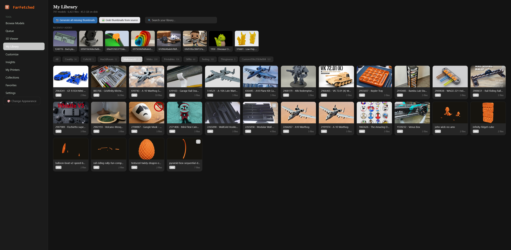 | 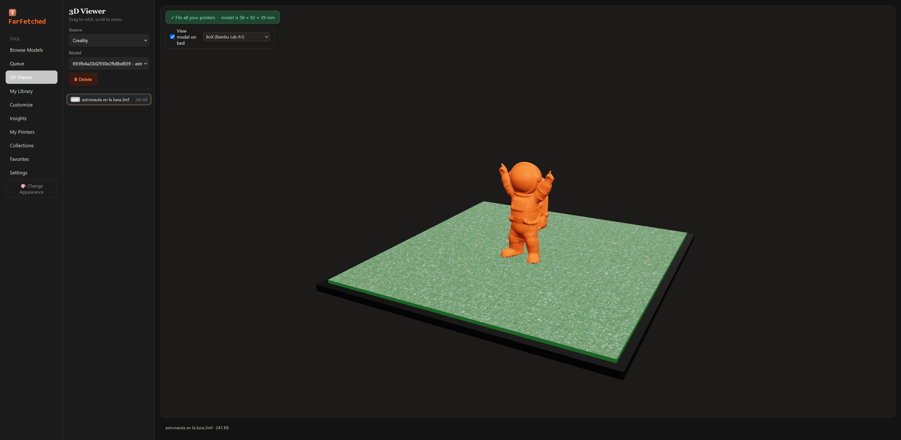 |

A clean, searchable library of everything you've downloaded — with a built-in STL/3MF viewer that shows your model sitting on a printer bed.

### Organize & track

| Collections | Favorites |
|:-----------:|:---------:|
| 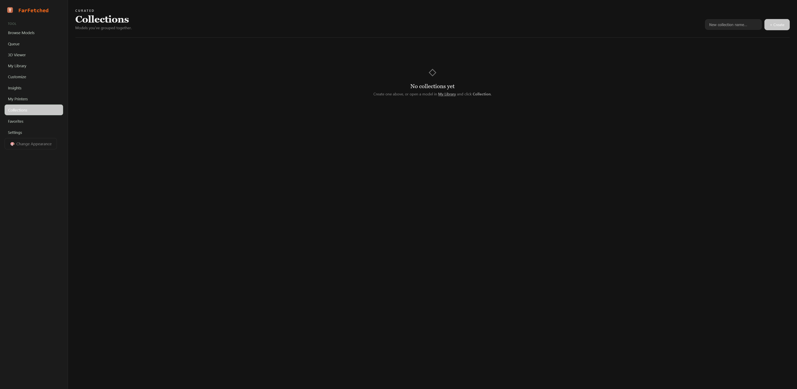 | 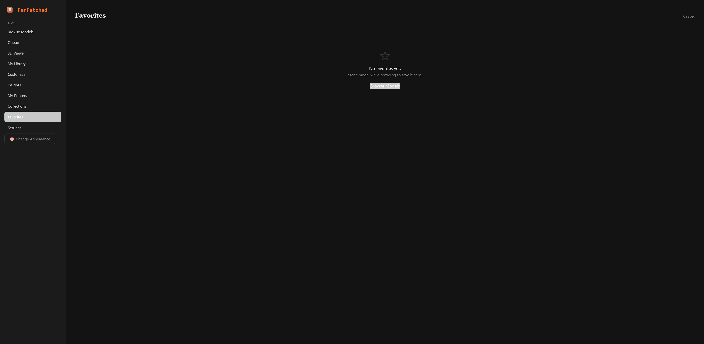 |

| Library Insights | Local Custom Folders |
|:----------------:|:--------------------:|
| 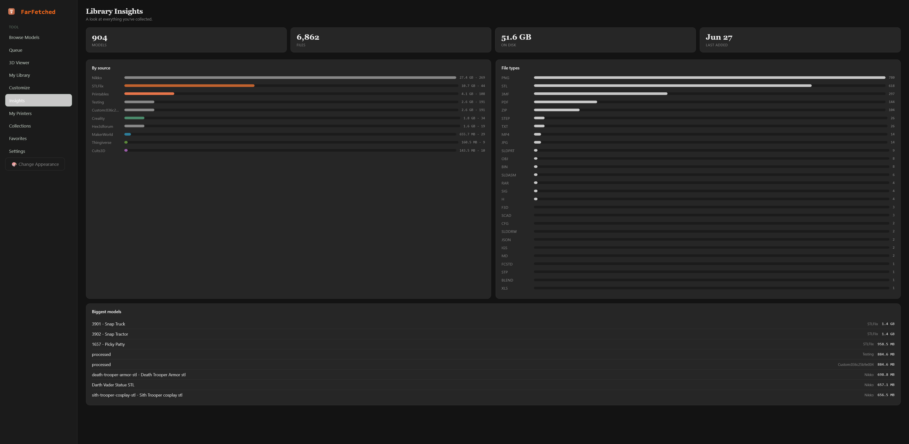 | 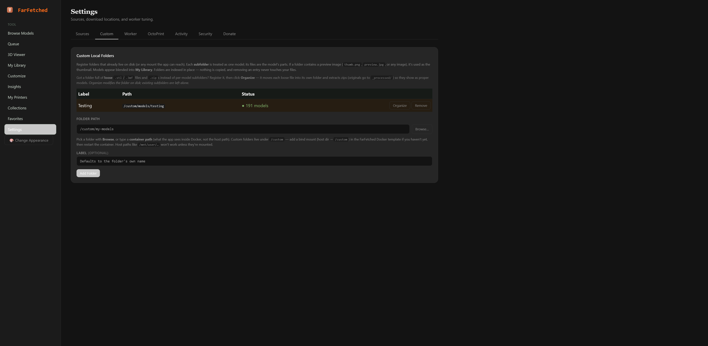 |

Group models into collections, star your favorites, track library stats, and index folders you already have on disk — no copying required.

### Printer management & OctoPrint

| My Printers | OctoPrint Integration |
|:-----------:|:---------------------:|
| 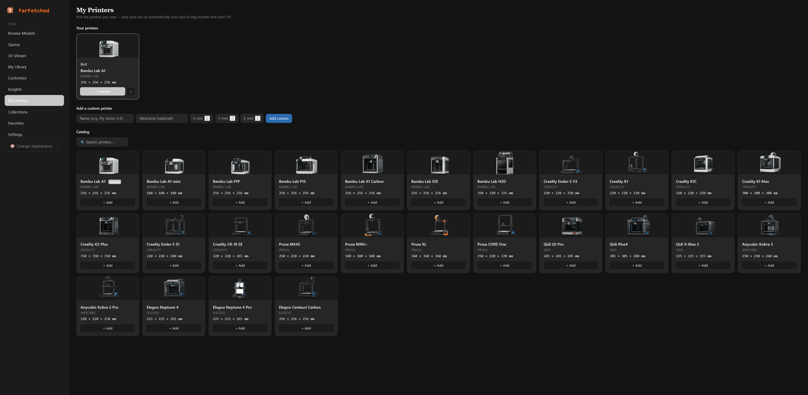 | 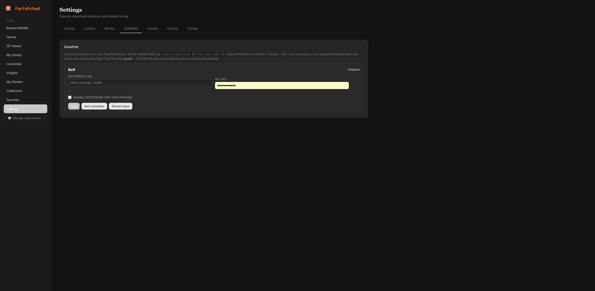 |

Manage your printers with real bed dimensions, and connect each one to its own OctoPrint instance for status, file upload, and print control.

### Download pipeline

| Download Queue | Worker Pacing |
|:--------------:|:-------------:|
| 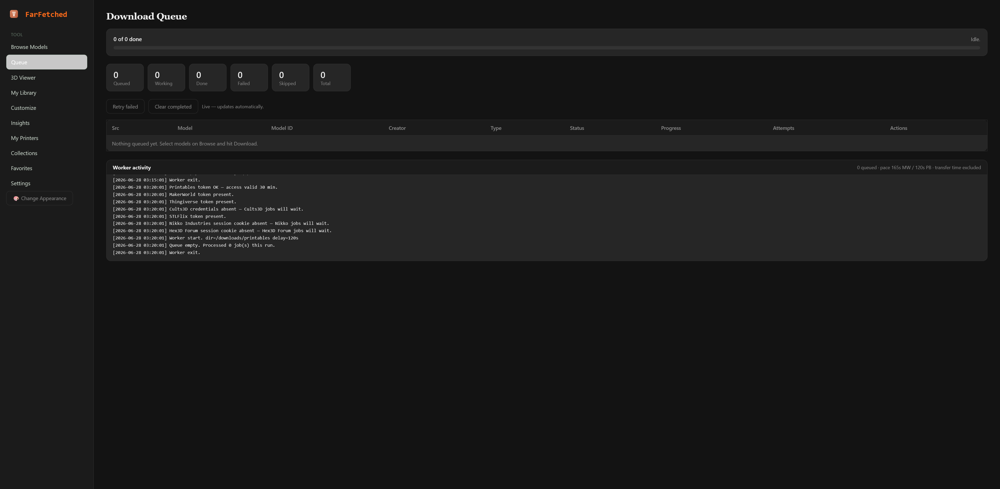 | 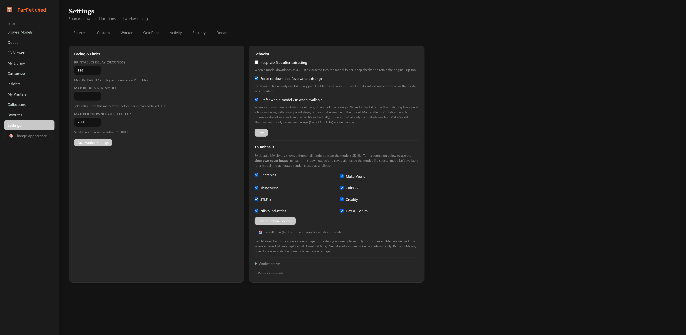 |

Queue everything at once; a patient background worker pulls it down one file at a time at a polite, configurable pace.

### Configurable & secure

| Source Settings | Security |
|:---------------:|:--------:|
| 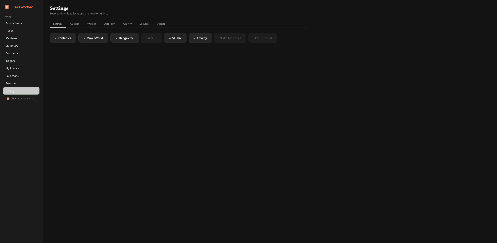 | 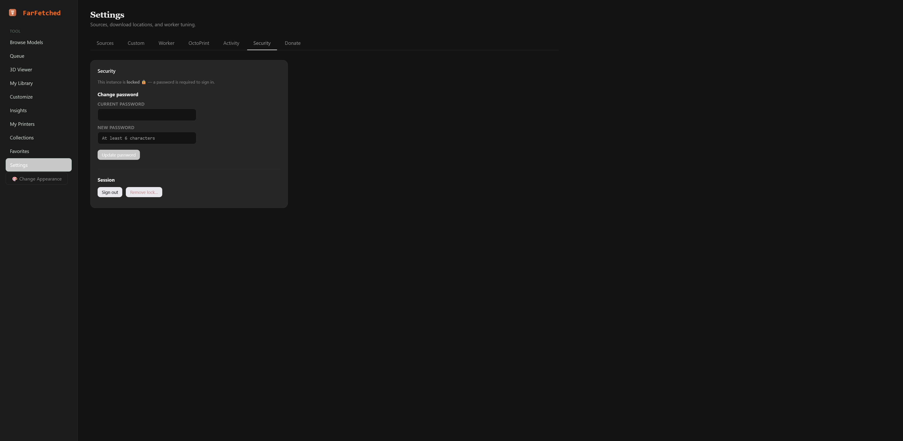 |

Per-source settings and pacing, with an optional password lock for instances reachable beyond your LAN.

---

## Quick start (Docker)

```bash
docker run -d \
  --name FarFetched \
  -p 16545:80 \
  -e FETCHER_DOWNLOAD_DIR=/downloads \
  -e FETCHER_DOWNLOAD_DELAY=120 \
  -v /path/to/your/models:/downloads \
  -v /path/to/persistent/data:/var/www/html/private \
  -v /path/to/your/custom-folders:/custom \
  ghcr.io/pumpkinpieman/farfetched:latest
```

> The `/custom` mount is optional — it's only needed for the **Custom Local Folders** feature (Settings → Custom). See [Custom Local Folders](#custom-local-folders) below.

Then open `http://your-server:16545` and add your source tokens under **Settings**.

### Environment variables

| Variable | Default | Purpose |
|---|---|---|
| `FETCHER_DOWNLOAD_DIR` | `/downloads` | Container path where models are saved (bind-mount this). |
| `FETCHER_DOWNLOAD_DELAY` | `120` | Default seconds between downloads (also tunable per-source in Settings). |

### Volumes

| Mount | Purpose |
|---|---|
| `/downloads` | Where your models land. Map to a host folder you control. |
| `/var/www/html/private` | Persistent state: SQLite job queue, favorites, collections, printer profiles, tokens, config, logs, and the optional password hash. |
| `/custom` | **Optional.** Host folder(s) you want to browse and register as Custom Local Folders (indexed in place, never copied). Map a host directory here — e.g. a Google Drive sync target or an existing model archive. See below. |

> **⚠️ Storage placement — keep the database on stable local storage.**
> The `/var/www/html/private` volume holds a **SQLite database** (`fetcher.db`). SQLite's file locking is **unreliable on networked or merged/synced filesystems** — NFS, SMB/CIFS, and FUSE overlays such as **Unraid's array+cache user-shares**. Placing the database there causes intermittent `database is locked` errors and stalled queues, because the storage layer can relocate or sync the file underneath an open connection.
>
> **Map `/var/www/html/private` to a real local filesystem (a plain SSD/disk path), not a synced share.**
> - **Unraid:** set the `appdata` share to **cache-only** (`Use cache pool: Only`, or `Prefer` then run Mover) so the database lives on the cache SSD — *not* on the array. Mapping to the raw `/mnt/cache/...` path (instead of the FUSE `/mnt/user/...` path) achieves the same.
> - **Synology / QNAP / NAS:** keep it on internal SSD/HDD, not an NFS/SMB-mounted volume.
> - **Generic Docker:** a local bind-mount or named volume on the host's own disk is ideal.
>
> FarFetched auto-detects FUSE/network mounts and falls back to the portable `DELETE` journal mode (instead of WAL) to stay as safe as possible, but no application setting can fully compensate for a database file the storage layer is actively syncing. Stable local storage is strongly recommended. The `/downloads` and `/custom` volumes have no such constraint — only the `private` (database) volume matters here.

---

## Finding your auth tokens

Each source needs a token or credentials, pulled from your browser's DevTools while logged in. The in-app **Settings → Sources** page and the home page include step-by-step guides for Chrome, Firefox, Edge, and Safari. In brief:

- **Printables / MakerWorld / Thingiverse / STLFlix** — DevTools → Network → find an API/GraphQL request → copy the `Authorization: Bearer …` header.
- **Cults3D** — DevTools → Application/Storage → Cookies → copy `user_email` and `user_token`.
- **Creality Cloud** — DevTools → Application/Storage → Cookies → copy `model_token`, `model_user_id`, and `cf_clearance`.
- **Nikko Industries** — no API; DevTools → Application/Storage → Cookies → copy the full Cookie header from a logged-in tab (membership grants unlimited downloads across the whole library, not per-model).
- **Hex3D Forum** — a phpBB forum, also no API; copy the full Cookie header the same way, then list which forum IDs (the number after `f=` in each forum's URL) you want FarFetched to browse.

Tokens expire on each platform's own schedule (Printables ~1h, STLFlix ~30 days, Creality's `cf_clearance` fastest); cookie-based sources have no fixed expiry and vary by server config. Just re-paste when a source stops authing.

---

## Custom Local Folders

Beyond the sources FarFetched downloads from, you can register folders you **already have on disk** — an existing model archive, a Google Drive / Dropbox folder synced locally, an SMB share, anything. These are **indexed in place (never copied)**, each subfolder is treated as one model, and they appear blended into **My Library**. Removing a registered folder never touches the files.

Configure them under **Settings → Custom**, with a built-in folder browser so you don't have to type paths.

### The one thing to understand: container paths, not host paths

FarFetched runs in a container, so it only sees what's **bind-mounted** into it. A path that exists on your host (e.g. `/mnt/user/Downloads/MyModels`) is invisible to the app unless that location is mounted. Inside the container the same files appear at the **container path** you mapped them to — which is usually different from the host path (e.g. host `/mnt/user/Downloads` → container `/downloads`).

This is the single most common point of confusion: entering a host path the container can't see fails with *"That path is not a folder or is not reachable from the container."* Always use the **container path**.

### Setup

1. **Add a bind mount** for the folder(s) you want to register. The convention is to map them to `/custom` in the container:

   - **Unraid:** edit the FarFetched container → *Add another Path* → Container Path `/custom`, Host Path `/mnt/user/YourCustomArea`, then Apply.
   - **docker run / compose:** add `-v /mnt/user/YourCustomArea:/custom`.

   Tip: point `/custom` at a **dedicated** host folder (e.g. `/mnt/user/CustomModels`) rather than your existing Downloads, so custom folders stay separate from the auto-scanned `/downloads` sources and nothing double-lists.

2. **Verify** the mount is live:
   ```bash
   docker exec FarFetched ls -la /custom
   ```
   This should list your host folder's contents. If it says *No such file or directory*, the mount isn't applied yet.

3. **Register** in the app: **Settings → Custom → Browse…**, navigate into `/custom`, pick a folder, and **Add Folder**. Its models now show in My Library.

### Thumbnails

Custom folders use an **existing preview image** in each model subfolder (`thumb.png`, `preview.jpg`, `cover.*`, or the first image found) — they are not rendered from the STL. Subfolders without any image show a "no preview" placeholder.

### Notes

- The folder browser is **jailed to `/custom`** — it cannot navigate into system or app directories.
- Registering is non-destructive and reversible: the folder list lives in config; your files are never moved, copied, or modified.
- Drop new model subfolders into a registered folder at any time — they appear on the next My Library load (no re-import step).

---

## Architecture

- **PHP 8.3 + Apache** in a single Docker image.
- **SQLite (WAL)** job queue, favorites, collections, and printer profiles in the persistent volume.
- **Background worker** invoked by cron, self-locking against overlap, self-pacing between downloads.
- **Three.js** viewer for STL/3MF preview, and the multi-part arrangement scene in Customize & Pose.
- **OpenSCAD** parametric rendering for customizable models.
- **Vanilla JS** front end — no build step.

### Notable engineering

- **Lock-free live progress** — the worker streams state to a small JSON file the UI polls, rather than fighting the job store for write locks.
- **Defensive API queries** — GraphQL queries ask for the richer shape first and fall back automatically, so a schema change degrades one feature instead of blanking the page.
- **Resilient 3MF loading** — a fallback unzips the archive and parses mesh geometry directly, then re-seats the model upright.
- **Cron-safe path resolution** — path resolution falls back through the process env, the entrypoint env file, and the conventional mount point, so downloads land correctly regardless of how the worker is launched.
- **Server-side image proxy** — thumbnails from CORS-restricted CDNs are streamed through an allowlisted server-side proxy.
- **Auto-format detection with fallback** — handles zip vs. bare .3mf/.stl per model, with an STL → 3MF → pack fallback when a requested format is missing.
- **Session-based source clients** — sources like Cults3D, Creality Cloud, Nikko Industries, and the Hex3D forum authenticate with browser session credentials; signed or session-gated download URLs are resolved per-job and re-minted automatically when they expire.
- **HTML-scraped sources** — Nikko Industries and the Hex3D forum have no public API; their catalogs are browsed via targeted, defensive HTML parsing rather than a structured endpoint.
- **WAL → DELETE SQLite fallback** — automatically falls back to DELETE journal mode on filesystems (FUSE/network mounts) where WAL locking is unreliable.

---

## Project layout

```
webroot/                     # Apache document root
├── index.php                # Browse / search UI + router
├── home.php                 # Source picker + token guide
├── customize.php            # Customize & Pose: OpenSCAD render + part arrangement
├── collections.php / collections_view.php   # Saved model collections
├── printers.php / printer_catalog.php / printer_action.php  # Printer build-volume profiles
├── jobs.php / jobs_status.php  # Download queue (live)
├── viewer.php                # STL / 3MF 3D viewer + delete
├── favorites.php             # Saved (starred) models
├── favorite.php              # Star/unstar endpoint
├── insights.php              # Library stats dashboard
├── settings.php               # Per-source auth, worker tuning, donate
├── auth.php / auth_action.php # Optional password lock
├── worker.php                 # CLI download worker (cron)
├── bootstrap.php              # Config, paths, DB, shared helpers
├── proxy.php                  # Server-side image proxy
├── model_file.php             # Path-safe file streaming for the viewer
├── model_delete.php           # Model deletion endpoint
├── scad_render.php            # OpenSCAD render endpoint for Customize & Pose
├── enqueue.php / job_action.php
└── *Service.php               # One client per source
```

---

## Security notes

- All state-changing endpoints require POST + CSRF token.
- Source slugs and model names are validated to single path segments; deletion is confirmed to resolve inside the source directory via `realpath()` before any file is touched.
- The image proxy is host-allowlisted and follows redirects only within that allowlist (SSRF-safe).
- Tokens and session cookies live in the private volume, never in the web root.
- The optional password lock stores only a bcrypt hash, no username — this is a single-user, self-hosted tool.

---

## Support

Like the project? [Buy me a ko-fi ☕](https://ko-fi.com/bloodthirstycheeseburger90415)

---

## License

Open source. See `LICENSE` for details.
